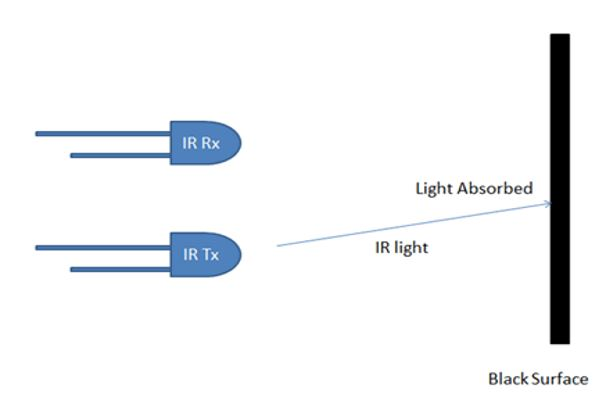

# Line-Following-Robot
One of the advanced mobile robots is the Line Follower Robot. It is basically a robot which follows a particular path or trajectory and decides its own course of action which interacts with obstacle. The path can be a black line on the white floor (visible) or a magnetic field (invisible). The present condition in industry is they are carrying the parcels or materials one place to another place using the crane system. Sometimes lifting of big weights at that time may cause the breakage of lifting materials and will be cause damage to the parcels also. The line following robots is commonly used for carry children through shopping malls, homes, entertainment places, industries. The use of line following robotic vehicle is transport the materials from one place to another place in the industries. This robot movement completely depends on the track. The robot can do anything you set them to do. Like in factories all they have to do with making their products is make the robot.

# Motivation
The purpose of our project is to save the time and human work for the transportation of books and other accessories like chalk, duster, water bottle etc. From the departmental staffroom to classroom. Another purpose of this project is to bring the automation in the colleges. Just by giving a command on his/her cell one can deliver the books & accessories from the staffroom to the class. For senior faculties carrying heavy books is challenging and also it can be time consuming. By using our project we can get rid of this problem. Also there was need of some modernization in technical institutions. And also for the need of becoming tech-savvy we decided to design & build this project.
 
 
# CONCEPT OF LINE FOLLOWER:
The line follower robot is a mobile machine that can detect and follow the line drawn on the floor. Generally, the path is predefined and can be either visible like a black line on a white surface with a high contrasted colour or it can be invisible like a magnetic filed.

 

 
In this arduino based line follower robot we have used IR Transmitters and IR receivers also called photo diodes. They are used for sending and receiving light. IR transmits infrared lights. When infrared rays fall on white surface, it’s reflected back by photodiodes which generates some voltage changes. When IR light falls on a black surface, light is absorb by the black surface and no rays are reflected back, thus photo diode does not receive any light or rays
Here in this arduino line follower robot when sensor senses white surface then arduino gets 1 as input and when senses black line arduino gets 0 as input.

Control Section:
Arduino UNO is used for controlling whole the process of line follower robot. The outputs of comparators are connected to digital pin number 2 and 3 of arduino. Arduino read these signals and send commands to driver circuit to drive line follower. 
 

Driver section:
Driver section consists motor driver and two DC motors. Motor driver is used for driving motors because arduino does not supply enough voltage and current to motor. So we add a motor driver circuit to get enough voltage and current for motor. Arduino sends commands to this motor driver and then it drive motors.

Working of Line Follower Robot using Arduino:
Working of line follower is very interesting. Line follower robot senses black line by using sensor and then sends the signal to arduino. Then arduino drives the motor according to sensors' output.

Here in this project we are using two IR sensor modules namely left sensor and right sensor. When both left and right sensor senses white then robot move forward.

If left sensor comes on black line then robot turn left side.

 
If right sensor sense black line then robot turn right side until both sensor comes at white surface. When white surface comes robot starts moving on forward again.

When option 108 is pressed then robot stops when all sensors come on black strip.

When option 109 is pressed then robot stops when all sensors come on white surface

# Required Components
Arduino
In our Project we have used a microcontroller to control whole the process of system that is ARDUINO. Arduino is an open source hardware and very useful for project developments. There are many types of arduino like Arduino UNO, arduino mega, arduino pro mini, Lilypad etc. available in the market. Here we have used arduino UNO in this project as Arduino UNO is small and so bread board compatible.

Drive mechanism:
We have used 4 caster wheel attached to 4 motors of robot can be controlled accordingly.
Clamp, Motor and Wheel:

Chassis layout:
Our first step is to drill holes on four sides of chassis to attach clamps with motor and caster wheel.

12V-1.2Amp Rechargeable battery
Power supply to motors
 
We also need 9V battery for power supply to Arduino.

Motor driver (LM293D)
 
Switching of motors is managed my   motor driver as per program to Arduino.

Bluetooth circuit (HC-05)
 
For communication between Application and Arduino

Jumper wires (M to F).  
 
Wires for connection between sensor and circuits

6 Channel IR array sensor.
 
Array sensor to detect black line and/or white line

Circuit Diagram

Android application
 
I have developed app for selecting room number by MIT APP INVENTOR.

OVERVIEW OF LINE FOLLOWING ROBOT SYSTEM:
This smart and intelligent line following robot material supply system has divides in serial parts sensing, comparators, motor drive and actuators. The robot uses IR sensors to sense the line. An array of 6 IR LED’s (Tx) and sensors (Rx), facing the ground has been used in this setup.

FUTURE SCOPE:
Line following robot based material supply system can play a vital role in field of hospitality also line follower application over electronics engineering can’t be underestimated. In India many people show reluctance to get admitted in a hospital due to high cost issue. The cost of cure can be reduced by using application of line following robot. Camera can be attached to line following robot so that status of every patient can be observed from single room. A GSM MODULE can placed in line following robot so if any untoward accident takes occurs then system can make call to doctor. By using line following robot in real time application, health care system can be also managed in an efficient way.         
Conclusion:
The cost of health care in India greatly depends upon the land and location of building, the infrastructure and facilities and skilled staff required to maintain the expensive machinery. In a country like India where the population is more and resources are scarce. It is very much expensive to built this high end projects at every location. So what this system is an alternate to the existing system with robotic machinery which can handle tasks with lower per capita cost and better accuracy. This is very helpful to staff members in schools & colleges.
 
 SUMMARY:
Chassis of 75 cm height is made. 4 motor clamps are mounted on four ends of lower sides of the chassis.
Johnson motors of 100 rpm are mounted on four clamps.
Connection of two motors on each sides are taken to the motor drive. Arduino and IR sensor is mounted on bottom front side of chassis.
Power of 12V & 1.5amp is provided to motors via. Motor drive IC. Power of 9V is supply to Arduino.
This is overall construction of line following robot.

